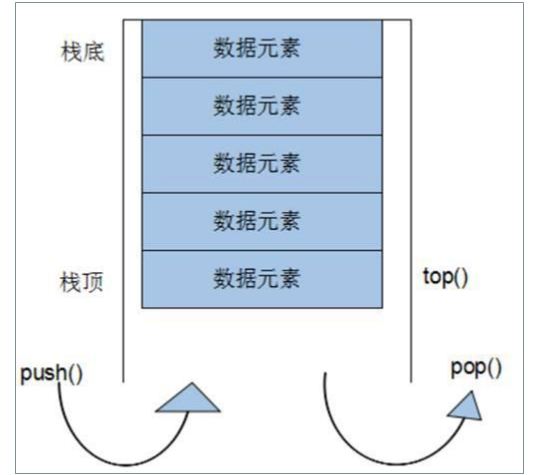

`std::stack`是C++标准模板库(STL)中的一个容器适配器，它提供了一种后进先出(Last-In-First-Out, LIFO)的数据结构，即栈。`std::stack`并不是一个独立的容器，而是基于其他容器（如 `std::vector`、`std::deque`或 `std::list`）实现的，通常默认使用 `std::deque`作为基础容器。这意味着 `stack`的元素存储和管理实际上是委托给了底层的容器。



### 基本操作和接口

#### 头文件

```cpp
#include <stack>
```

#### 声明和初始化

```cpp
std::stack<int> myStack; // 默认使用std::deque作为底层容器
std::stack<char, std::vector<char>> charStack; // 使用std::vector作为底层容器
```

#### 基本方法

- **压栈（入栈）**: 使用 `push`方法在栈顶添加元素。

```cpp
myStack.push(10);
```

- **弹栈（出栈）**: 使用 `pop`方法移除栈顶元素，无返回值。

```cpp
myStack.pop();
```

- **访问栈顶元素**: 使用 `top`方法获取但不移除栈顶元素。

```cpp
int topElement = myStack.top();
```

- **判断是否为空**: 使用 `empty`方法检查栈是否为空。

```cpp
bool isEmpty = myStack.empty();
```

- **栈的大小**: 使用 `size`方法获取栈中元素的数量。

```cpp
size_t stackSize = myStack.size();
```

### 示例代码

下面是一个简单的使用 `std::stack`实现的示例，演示了如何压栈、弹栈、访问栈顶元素以及检查栈的状态。

```cpp
#include <iostream>
#include <stack>

int main() {
    std::stack<int> mystack;

    // 入栈操作
    mystack.push(10);
    mystack.push(20);
    mystack.push(30);

    std::cout << "栈的大小: " << mystack.size() << std::endl;

    // 访问栈顶元素
    std::cout << "栈顶元素: " << mystack.top() << std::endl;

    // 出栈操作
    mystack.pop();

    // 再次访问栈顶元素
    std::cout << "弹出一个元素后，新的栈顶元素: " << mystack.top() << std::endl;

    // 检查是否为空
    if (mystack.empty())
        std::cout << "栈为空" << std::endl;
    else
        std::cout << "栈非空" << std::endl;

    return 0;
}
```

### 注意事项

- `stack`不支持直接遍历，因为它是基于LIFO原则设计的，只允许访问和操作栈顶元素。
- 在使用 `top`和 `pop`之前，应该先用 `empty`检查栈是否为空，以避免未定义行为。
- `stack`的性能依赖于其底层容器，例如，基于 `deque`实现的 `stack`在两端操作上效率较高，而基于 `vector`的 `stack`在内存连续性上表现较好。
