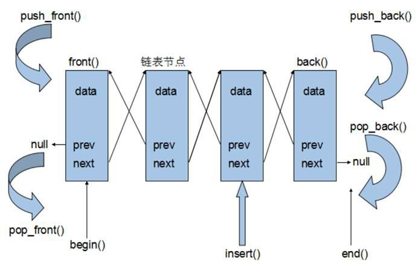

- `queue`容器是C++标准模板库(STL)中的一个容器适配器，它提供了一种先进先出(FIFO, First In First Out)的数据结构实现。这意味着最早添加到队列中的元素也将是最先被移除的元素。队列有两个主要的操作端点：前端和后端。元素从后端（称为队尾）添加，而从前端（称为队头）移除。以下是关于 `queue`容器的一些基本要点和操作：
  

  ### 基本概念


  - **容器适配器**：`queue`不是一个独立的容器，而是基于其他容器（默认情况下是 `deque`，但也可以是 `list`）实现的。
  - **操作限制**：由于底层数据结构的限制，`queue`容器不提供迭代器，并且不能直接访问除了队头和队尾之外的元素。

  ### 构造函数

  - `queue<T>`：默认构造函数，创建一个空队列。
  - `queue<T, Container>`：使用指定的容器类型（如 `list`或 `deque`）构造队列。

  ### 存取、插入与删除操作

  - **插入元素**：`push(const T& value)` 或 `push(T&& value)`，在队列的后端添加元素。
  - **删除元素**：`pop()`，从队列的前端移除元素（无返回值，只改变队列）。
  - **访问元素**：
    - `front()`，返回队头元素的引用，不移除元素。
    - `back()`，返回队尾元素的引用，也不移除元素。

  ### 赋值操作

  - `queue& operator=(const queue&)`，队列赋值运算符，用于复制一个队列到另一个队列。
  - 可能还有移动赋值运算符 `queue& operator=(queue&&)`，用于转移资源。

  ### 大小操作

  - `size()`，返回队列中元素的数量。
  - `empty()`，检查队列是否为空，如果为空则返回 `true`，否则返回 `false`。

  ### 示例

  ```cpp
  #include <iostream>
  #include <queue>

  int main() {
      std::queue<int> q;

      // 插入元素
      q.push(1);
      q.push(2);
      q.push(3);

      // 输出队列大小
      std::cout << "Queue size: " << q.size() << std::endl;

      // 访问但不移除队头元素
      std::cout << "Front element: " << q.front() << std::endl;

      // 移除队头元素
      q.pop();

      // 再次输出队列大小
      std::cout << "After pop, queue size: " << q.size() << std::endl;

      return 0;
  }
  ```

/**
log
Queue size: 3
Queue front: 10  Queue size: 3
Queue front: 20  Queue size: 2
Queue front: 30  Queue size: 1
Queue size: 0
*/

```
  这个示例展示了如何创建一个队列，向其中添加元素，访问队头元素，以及移除队头元素。
```
