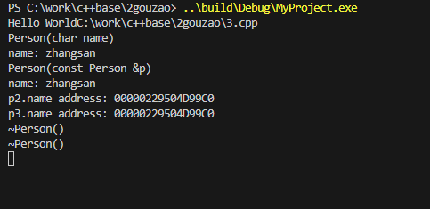
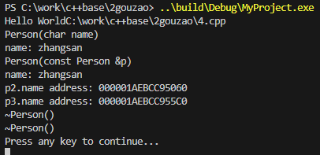

## 构造函数

构造函数（Constructor）是C++中的一种特殊成员函数，它的主要作用是在创建对象时进行初始化工作。构造函数的名称与类名相同，并且没有返回类型，甚至连void也没有。构造函数可以有参数，也可以重载，这样就可以在创建对象时提供不同的初始化方式。

### **定义**：

```cpp
class MyClass {
public:
    // 这是构造函数
    MyClass() {
        // 构造函数的代码，用于初始化对象
        // 例如，初始化成员变量
        data = 0;
    }

    // 构造函数可以有参数
    MyClass(int value) {
        data = value;
    }

private:
    int data;
};
```

### **实际作用**：

构造函数在对象创建时自动调用，确保对象的成员变量有一个合理的初始状态。如果没有定义任何构造函数，编译器会提供一个默认构造函数，但这个默认构造函数不会做任何初始化工作，成员变量将保持它们在内存中的随机值。

### **结合示例**：

```cpp
#include <iostream>

class Point {
public:
    // 默认构造函数
    Point() : x(0), y(0) {
        std::cout << "Point created at (" << x << ", " << y << ")\n";
    }

    // 带参数的构造函数
    Point(int xVal, int yVal) : x(xVal), y(yVal) {
        std::cout << "Point created at (" << x << ", " << y << ")\n";
    }

    // 成员函数，用于输出点的坐标
    void print() {
        std::cout << "Point at (" << x << ", " << y << ")\n";
    }

private:
    int x;
    int y;
};

int main() {
    // 使用默认构造函数创建对象
    Point p1;
    p1.print(); // 输出: Point at (0, 0)

    // 使用带参数的构造函数创建对象
    Point p2(5, 10);
    p2.print(); // 输出: Point at (5, 10)

    return 0;
}
```

在这个示例中，我们定义了一个 `Point`类，它有两个构造函数：一个默认构造函数和一个带参数的构造函数。在 `main`函数中，我们分别使用这两个构造函数创建了 `Point`对象，并调用了 `print`成员函数来显示点的坐标。通过构造函数，我们确保了在创建对象时，对象的成员变量 `x`和 `y`被正确初始化。

##  拷贝构造

拷贝构造函数（Copy Constructor）是C++中的一种特殊成员函数，它用于创建一个新对象，该对象是现有对象的副本。拷贝构造函数通常用于以下情况：

1. 用一个对象初始化另一个对象。
2. 对象作为参数传递给函数（按值传递）。
3. 对象作为函数的返回值（按值返回）。

### **定义**：

拷贝构造函数的定义形式如下，它接受一个同类型的引用作为参数（通常是const引用）：

```cpp
class MyClass {
public:
    // 默认构造函数
    MyClass() {
        // 初始化代码
    }

    // 拷贝构造函数
    MyClass(const MyClass& other) {
        // 从other复制数据到当前对象
        // 例如，复制成员变量
        data = other.data;
    }

private:
    int data;
};
```

### **实际作用**：

拷贝构造函数确保在创建对象副本时，副本对象的成员变量与原对象的成员变量具有相同的值。如果没有定义拷贝构造函数，编译器会提供一个默认的拷贝构造函数，它执行成员变量的浅拷贝（即逐成员拷贝）。对于包含指针成员的类，浅拷贝可能导致两个对象的指针指向同一块内存，这会引起问题，因此需要定义深拷贝的拷贝构造函数。

### **结合示例**：

```cpp
#include <iostream>

class MyString {
public:
    // 默认构造函数
    MyString() : data(nullptr), size(0) {}

    // 带参数的构造函数
    MyString(const char* str) {
        size = std::strlen(str) + 1;
        data = new char[size];
        std::strcpy(data, str);
    }

    // 拷贝构造函数
    MyString(const MyString& other) {
        size = other.size;
        data = new char[size];
        std::strcpy(data, other.data);
    }

    // 析构函数
    ~MyString() {
        delete[] data;
    }

    // 成员函数，用于输出字符串
    void print() const {
        std::cout << data << '\n';
    }

private:
    char* data;
    size_t size;
};

int main() {
    MyString original("Hello, World!");
    original.print(); // 输出: Hello, World!

    // 使用拷贝构造函数创建副本
    MyString copy = original;
    copy.print(); // 输出: Hello, World!

    return 0;
}
```

在这个示例中，我们定义了一个 `MyString`类，它有一个拷贝构造函数。在 `main`函数中，我们创建了一个 `MyString`对象 `original`，然后使用拷贝构造函数创建了它的副本 `copy`。通过拷贝构造函数，我们确保了 `copy`对象拥有自己的内存空间，而不是与 `original`共享同一块内存。这样，当对象被销毁时，它们的析构函数可以安全地释放各自的内存，而不会发生重复释放内存的错误。

##  浅拷贝和深拷贝

**c++：** 在C++中，浅拷贝和深拷贝是处理对象复制时的两种不同方法，它们在处理包含指针或动态分配内存的对象时表现出重要的差异。

### **浅拷贝（Shallow Copy）**：

浅拷贝仅仅复制对象的成员变量的值，如果成员变量包含指针，则复制指针的值，而不是指针指向的数据。这意味着原始对象和复制对象的指针成员将指向同一块内存地址。

#### **定义与示例**：

```cpp
class Shallow {
public:
    int* data;
    Shallow(int d) {
        data = new int(d); // 分配内存
    }
    // 默认的拷贝构造函数是浅拷贝
    ~Shallow() {
        delete data; // 释放内存
    }
};

int main() {
    Shallow obj1(10);
    Shallow obj2 = obj1; // 浅拷贝发生

    return 0;
}
```

在这个示例中，当 `obj2`被创建时，它的 `data`成员仅仅复制了 `obj1`的 `data`成员的地址，而不是其指向的数据。这可能导致程序运行错误，比如双重释放同一内存块。

### **深拷贝（Deep Copy）**：

深拷贝不仅复制对象的成员变量的值，还复制指针指向的数据到新的内存地址。这样，原始对象和复制对象的指针成员将指向不同的内存地址，避免了浅拷贝中的问题。

#### **定义与示例**：

```cpp
class Deep {
public:
    int* data;
    Deep(int d) {
        data = new int(d); // 分配内存
    }
    // 自定义深拷贝构造函数
    Deep(const Deep& other) {
        data = new int(*other.data); // 复制数据到新的内存
    }
    ~Deep() {
        delete data; // 释放内存
    }
};

int main() {
    Deep obj1(10);
    Deep obj2 = obj1; // 深拷贝发生

    return 0;
}
```

在这个示例中，`obj2`的 `data`成员被初始化为一个新的内存地址，这个地址中存储了 `obj1`的 `data`成员指向的数据的副本。这样，每个对象都有自己独立的内存，避免了内存管理上的问题。

总结来说，深拷贝是在处理包含指针或动态分配内存的对象时更安全的复制方法，而浅拷贝在某些简单情况下可能足够使用，但需要小心内存管理问题。


3.cpp运行结果



4.cpp运行结果


